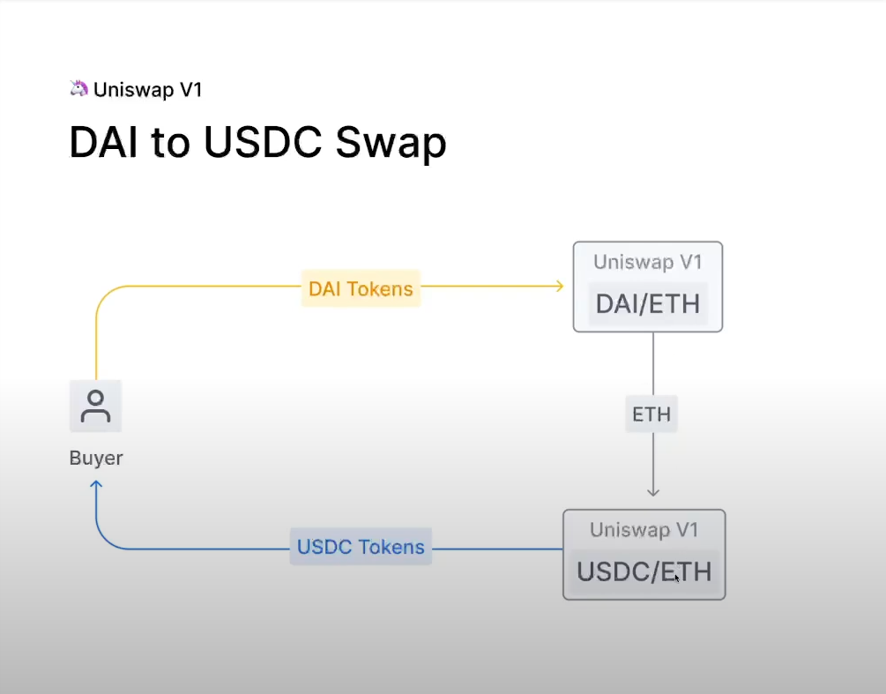
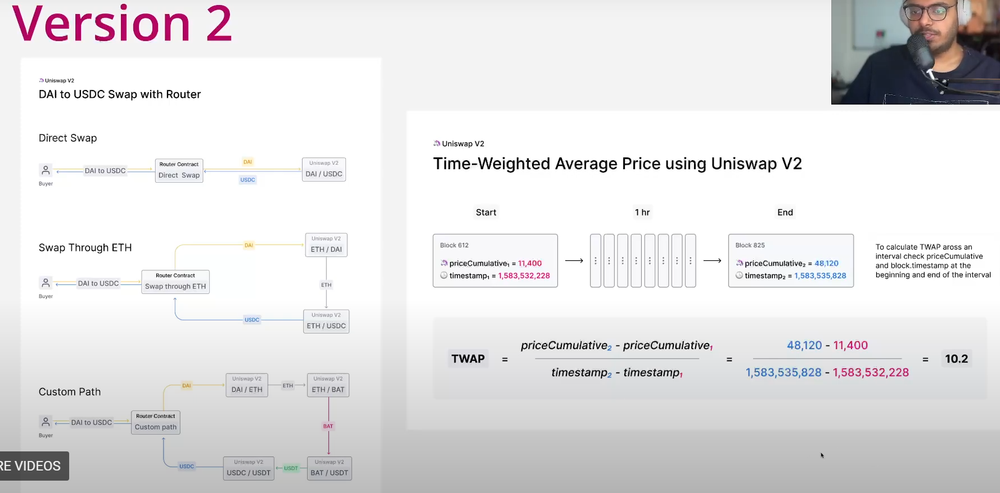
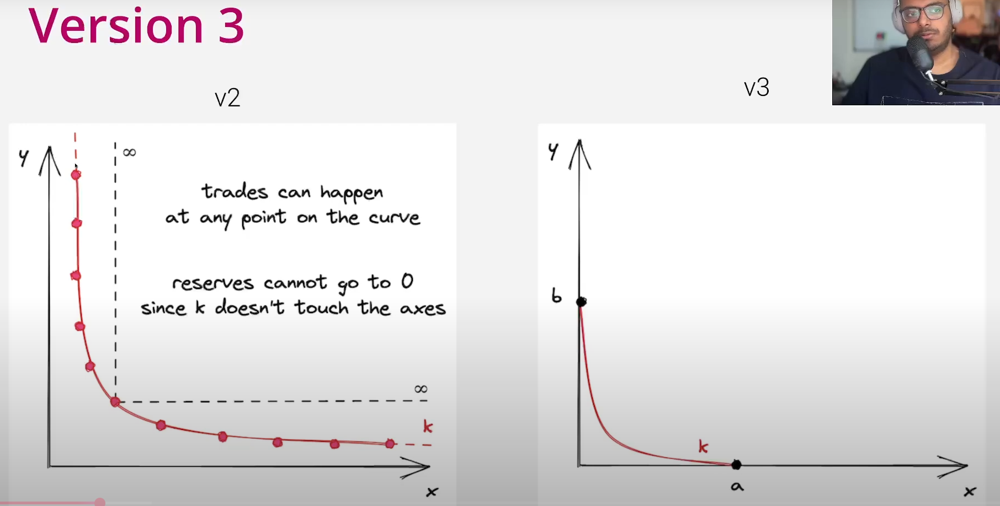
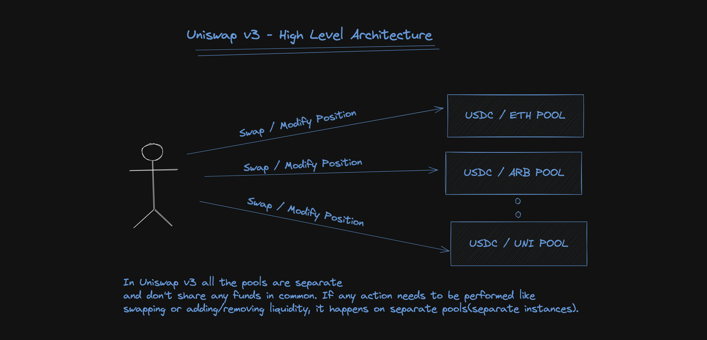
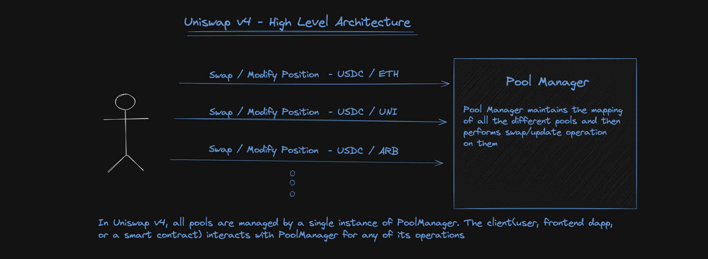

# Sesión 02 - Historia y Evolución de Uniswap (v1 -> v4)

## Historia de Uniswap de v1 a v4

- Hayden Adams, desempleado conoce el mundo de Ethereum gracias a [Karl Floersch](https://karl.tech/)
- La idea original de un DEX proviene de [Martin Koppelman](https://www.linkedin.com/pulse/martin-koppelman-defi-visionary-who-sparked-paul-mcolaka-mscfe-usmhf/) y fue expandida por Vitalik
- Hayden se pone a implementar estas ideas en código, aprendiendo sobre la marcha
- Uniswap v1 se lanza en noviembre 2018
- Fun Fact 🤓☝️: Se iba a llamar Unipeg
- En Abril 2019 levantan capital, ronda liderada por [Paradigm](https://www.paradigm.xyz/) y comienza crecimiento exponencial 🚀

### Uniswap v1

Uniswap v1 en un diagram:



- Factory contract, cualquiera puede desplegar una pool para un par ETH <-> ERC-20 token
- Primera implementación de un AMM, más especificamente un CPMM: La ecuación que todos conocemos y amamos: `xy = k`
- Problemas con v1:
  - No podias hacer swaps directos ERC-20 <-> ERC-20 (UX mala, costos de gas innecesarios)

### Uniswap v2

Innovaciones principales en v2:



- Lanzado a mediados de 2020
- Un hit 🎯, el protocolo más forkeado de la historia
- 3 innovaciones importantes:
  - Ahora puedes hacer swaps ERC-20 <-> ERC-20 usando un contrato router
  - TWAP oracle, no muy usado ahora, pero en su momento, gran innovación
  - Introdujo Flash Swaps (como Flash Loans, pero para swaps)

Nota: ¿Qué es Time-Weighted Average Price Oracle (TWAP)?

Nuevos problemas:

- Proveedores de liquidez sufrían mucha impermanent loss debido a la manera en que funciona la curva `xy = k`
- Provoca ineficiencias de precio ya que muchos tokens realmente no van a ser tradeados en los extremos de la curva

### Uniswap v3

Diagrama de v3:



- Lanzado en 2021
- La gran innovación 🔥: Liquidez Concentrada
- LPs ahora pueden decidir en qué rango quieren proveer su liquidez
- Downside: solo pueden ganar fees cuando se tradea en ese rango
- Upside: Capital trabajando más eficiente que nunca
- Fun fact 🤓☝️: El frontend oficial de Uniswap busca el mejor precio entre la liquidez de v2 y v3.

### Uniswap v4

- El problema primero:
  - ❌ Demasiados forks ➡️ Liquidez fragmentada
  - ❌ Confusión para usuari@s finales
  - ❌ Forks no auditados = Vulnerabilidades introducidas, posibles hacks o rugpull
- 🦄 Llega Uniswap v4 al rescate!
- Lanzado en enero 2025
- Introduce hooks 🪝🔥, que nos permiten crear funcionalidades nuevas sobre Uniswap sin forkear todo un DEX!
- Más innovaciones 🤓:
  - Nuevo sistema de contabilidad para liquidar saldos entre _maker_ y _taker_
  - Se utiliza por primera vez **Transient Storage (EIP-1153)** para optimización de gas
  - **Flash Accounting**, permite liquidar saldos pendientes al final de la transancción (introduce funcionalidad adicional)
  - Usuarios pueden no retirar sus tokens de las pools para ahorrar fees

### ¿Qué podemos construir con esto?

- Libros de órdenes onchain
- Curvas de precios personalizadas para crear mercados más eficientes para ciertos tokens (por ejemplo, stablecoins)
- Menos MEV tóxico
- Comisiones dinámicas que reaccionan ante situaciones del mundo real
- Depositar de liquidez fuera de rango en protocolos de lending, para que los LPs ganen rendimiento incluso cuando no se generan fees por swaps
- Auto-compounding de comisiones para reinvertir automáticamente en la posición de LP
- Creación de DEXes empresariales con pools que cumplen con KYC

## Arquitectura v4

Ahora sí, entremos a la arquitectura de v4, pero 1ero, qué problemas de v3 está tratando de resolver?

### Diseño Singleton

➡️ Diseño v3

Uniswap v3 —como ya sabemos— es un AMM de propósito general que introdujo el concepto de liquidez concentrada. En la imagen de arriba se puede ver cómo la liquidez se distribuye en diferentes rangos de precio para un pool ETH <> USDC. Gracias a la liquidez concentrada se volvió posible crear mercados altamente eficientes en capital, ya que los LPs no estaban forzados a proveer liquidez a lo largo de todo el rango de precios. Además, para tokens poco volátiles, la mayor parte de la liquidez se concentraba cerca de los precios comunes de intercambio.

Sin embargo, al igual que en Uniswap v2, v3 requería que cada pool fuera su propio contrato inteligente, desplegado a través del contrato `UniswapV3Factory`. Esto hacía que acciones como crear un nuevo pool o ejecutar un swap con múltiples hops fueran operaciones costosas.

Cada pool es un contrato en v3:



Pseudocódigo de cómo se crea una pool en v3:

```solidity
contract UniswapV3Factory {
	// This mapping is from "Token X" -> "Token Y" -> "Tick Spacing" -> "Pool Contract Address"
	// e.g. USDC -> WETH -> 10 -> 0x0....
	mapping(address => mapping(address => mapping(uint24 => address))) public pools;

	function createPool(address tokenX, address tokenY, uint24 fee, ...) {
		// Necessary checks

		address pool = new UniswapV3Pool{salt: ...}(); // CREATE2 Deployment
		pools[tokenX][tokenY][tickSpacing] = pool;
    }
}
```

- Uniswap v4 👉: Diseño Singleton
- Ahora un solo contrato (`PoolManager`) administra todas las pools, en lugar de que cada pool sea un contrato



➡️ Diseño v4

- Un solo contrato `PoolManager` administra todas las pools mediante un mapeo.
- Los pools ahora son _libraries_ de Solidity, no se hacen llamadas externas.

En pseudocódigo se vería así:

```solidity
// Pool Library
library Pool {
	function initialize(State storage self, ...) {
      ...
    }

  	function swap(State storage self, ...) {
      ...
    }

  	function modifyPosition(State storage self, ...) {
      ...
    }
}

// PoolManager
contract PoolManager {

	using Pools for *;
	mapping (PoolId id => Pool.State) internal pools;

	function swap(PoolId id, ...) {
		pools[id].swap(...); // Library Call
	}
}
```

A diferencia de v3, donde el mapping apuntaba a una dirección de contrato, en v4 apunta a una estructura Pool.State. Esta estructura contiene básicamente la misma información que un contrato de pool en v3, solo que ahora es parte del PoolManager.

Por ejemplo, en v3 teníamos funciones como slot0() para consultar datos del estado del pool. En v4 estos datos existen también, pero se accede a ellos desde PoolManager usando getters de la estructura.

### Flash Accounting Y Locking

➡️ Flash Accounting

En versiones anteriores, cada vez que se hacía un swap (incluso en un multi-hop), los tokens se tenían que transferir dentro y fuera de cada contrato individual, lo cual era costoso en gas.

Con la arquitectura singleton, esto cambia: ahora existe Flash Accounting.

Todos los tokens entran al PoolManager, se hacen todas las operaciones (swap simple o multi-hop) y al final se hace solo una transferencia final de salida. Esto reduce las transferencias necesarias sin importar el número de hops.

➡️ Locking

Para asegurar la atomicidad de operaciones complejas como swaps con múltiples pasos, v4 implementa un mecanismo de locking. Antes de cualquier acción clave (como swaps o modificación de liquidez), un contrato periférico debe llamar a unlock().

En pseudocódigo:

```solidity
function unlock(bytes calldata data) external returns (bytes memory result) {
	if (Lock.isUnlocked()) revert AlreadyUnlocked();
	Lock.unlock();
	result = IUnlockCallback(msg.sender).unlockCallback(data);
	if (NonZeroDeltaCount.read() != 0) revert CurrencyNotSettled();
	Lock.lock();
}
```

El flujo es:

- El contrato periférico llama a unlock().
- Se desbloquea el PoolManager y se llama el callback unlockCallback().
- Dentro del callback se pueden hacer swaps o modificar posiciones.
- Al terminar, se valida que todos los balances estén en cero.
- Si no hay pendientes, el PoolManager se bloquea de nuevo.

Esto permite hacer múltiples acciones dentro de una sola transacción sin errores contables.

➡️ Transient Storage

Para lograr eficiencia en gas, v4 aprovecha **Transient Storage**, introducido por EIP-1153 (incluido en el upgrade de Cancun).

Esto permite guardar variables temporales (como si el PoolManager está desbloqueado o el delta de balances) en una memoria transitoria que solo vive durante una transacción.

Pseudocódigo del uso en la librería `Lock`:

```solidity
library Lock {
	uint256 constant IS_UNLOCKED_SLOT = uint256(keccak256("Unlocked")) - 1;

	function unlock() internal {
		assembly { tstore(IS_UNLOCKED_SLOT, true) }
	}

	function lock() internal {
		assembly { tstore(IS_UNLOCKED_SLOT, false) }
	}

	function isUnlocked() internal view returns (bool unlocked) {
		assembly { unlocked := tload(IS_UNLOCKED_SLOT) }
	}
}
```

Actualmente solo se puede usar con **ensamblador de bajo nivel**, pero se espera que Solidity lo soporte directamente pronto.

Fun Fact 🤓☝️: Uniswap v4 se retrasó intencionalmente esperando a que EIP-1153 estuviera en mainnet.

### ERC-6909 Claims

v4 también incorpora el estándar [**ERC-6909**](https://eips.ethereum.org/EIPS/eip-6909), un contrato multitoken más simple que ERC-1155, para representar _claim tokens_.

Esto permite que traders frecuentes dejen sus fondos en el `PoolManager`, y a cambio reciban un token que representa su reclamo sobre esos fondos. En lugar de mover tokens reales, el PoolManager puede **quemar y acuñar claim tokens** internamente, lo que ahorra gas ya que no se hacen llamadas a contratos externos como los de USDC.

Esta eficiencia es clave para permitir modelos de **comisiones dinámicas**, ya que el costo de operar se reduce lo suficiente como para permitir mayor competitividad.

## v4 Hooks

### Introducción a los Hooks

### Bitmap de una address de un hook

### Flujo de un Swap

### Flujo para modificar una Posición de Liquidez

### Temas Adicionales

➡️ Consideraciones de Gas

➡️ Fragmentación de Liquidez

➡️ Licencia BSL
