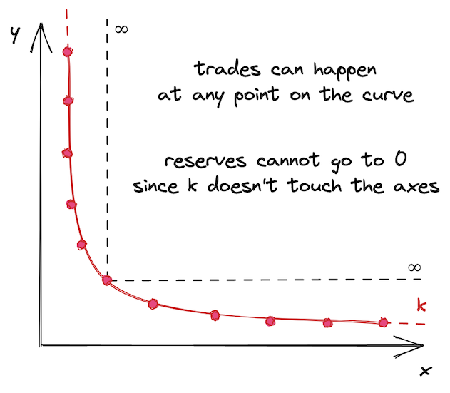
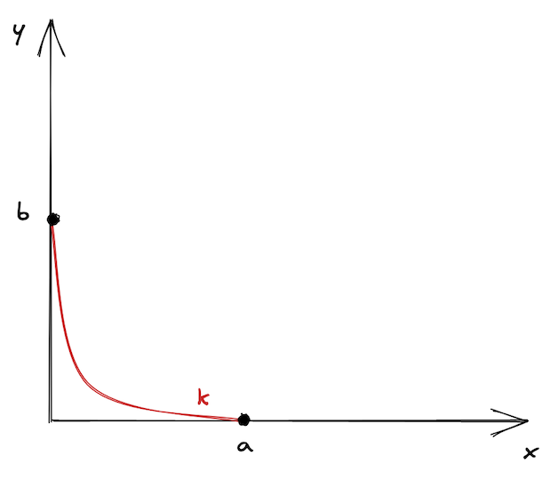
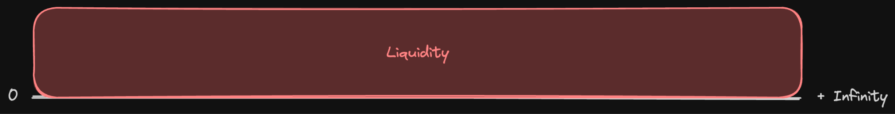
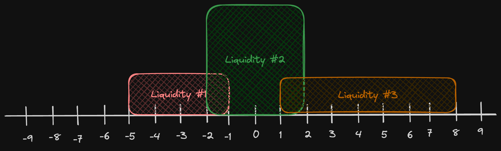
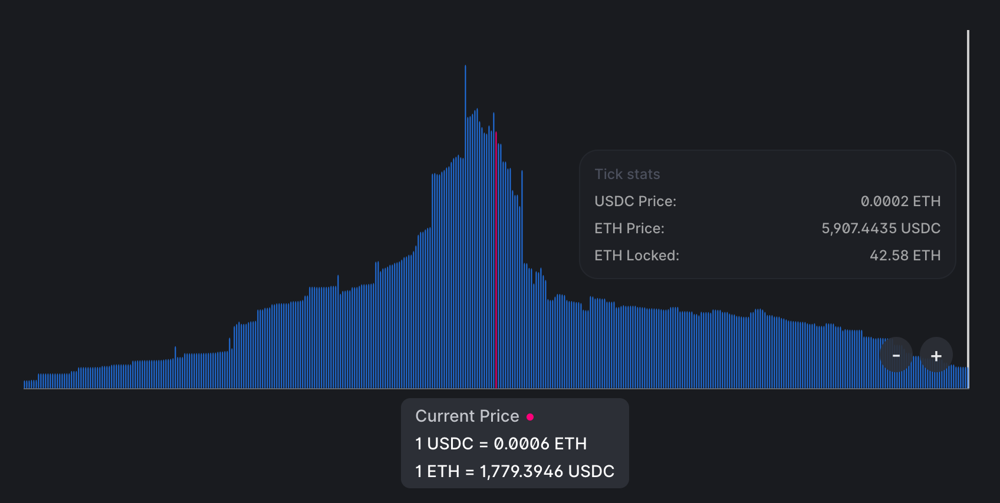
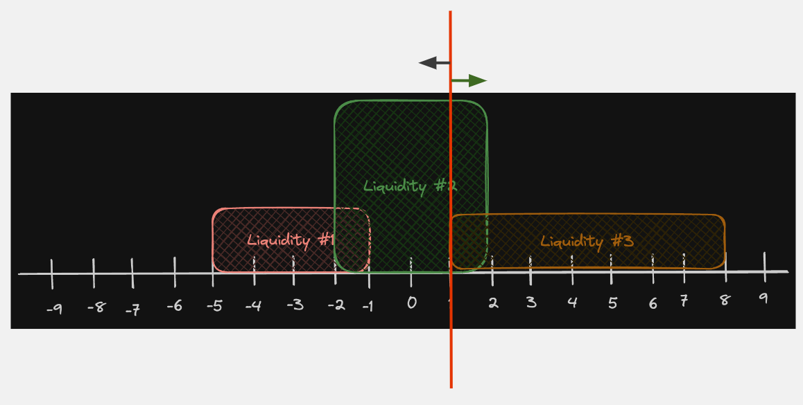
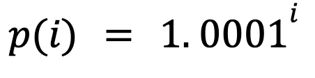

# Sesión 04 – Matemáticas de Uniswap: Ticks, Q64.96 y Precios

Vamos a ver 2 conceptos fundamentales para construir nuestros propios hooks:

- Ticks
- Q64.96

### Curvas de Precio Discretas

- Uniswap v2 es un CFMM simple, LPs siempre agregan liquidez en todo el rango de precios
- Usa la fórmula `x * y = k` donde `k` es una constante.
- En otras palabras, sin importar cuánto intercambies, nunca agotarás completamente un token en el pool.
- Esto produce una curva de precios continua e infinita que nunca toca los ejes.

En conclusión: La curva de precio en Uniswap v2 (imagen arriba) nunca toca los ejes. Es una curva continua, infinita.

- A partir de Uniswap v3 esto cambia. Uniswap v3 introduce la **liquidez concentrada**.
- Ahora los LPs pueden proveer liquidez en un rango específico y la ecuación `x * y = k` ya no es suficiente para determinar ciertos cálculos que en este momento no son muy relevantes.
- Lo importante es que al tener liquidez concentrada, la curva ahora se ve así:

- Ahora tenemos una curva finita, discreta.
- Si la curva ahora es finita, puede dividirse en un número finito de _secciones_. Estas secciones dan origen a los conceptos de _ticks_ y _tick spacing_ (espacio entre ticks).

### Distribución de Liquidez Concentrada

Para recapitular, en Uniswap v2 la liquidez se ve así, ya que todos los LPs tienen qué poner la liquidez en todo el rango:

Sin embargo, en v3, la distribución de la liquidez se vería así:

Esto quiere decir 2 cosas:

- Estas _áreas de liquidez_ pueden solaparse entre sí.
- Las _áreas de liquidez_ podrían nunca tocarse.

En la vida real esto se ve más o menos así:

La liquidez generalmente se agrupa alrededor del precio actual, y va disminuyendo conforme te alejas de ese precio.

### Ticks

Regresemos a esta imagen:

Nota los números del `-9` a `+9`. Estos son los _ticks_.

Un _tick_ entonces es un punto específico en la curva donde un trade puede ejecutarse. Cada tick, es un precio específico para el token. Nota también que todos los ticks están separados por la misma distancia (en este ejemplo, esa distancia es 1).

Conclusión #1 👉: Los ticks dividen la curva finita de precios en puntos discretos, equidistantes. Cada tick representa un precio específico en el que puede ocurrir un trade.

➡️ Sobre tick spacing

Ahora veamos esta imagen:

Supongamos que `1` representa el precio actual en el pool.

- Cuando se hace un trade, el precio solo puede moverse hacia 0 o hacia 2 (los trades solo pueden ocurrir en los ticks)
- Todos los ticks deben ser enteros, pero puede pasar que según la fórmula, el resultado de un swap debería colocar el próximo precio en `4.5`, lo que haremos en ese caso es redondear al tick más cercano disponible.
- Tomemos en cuenta que estos enteros son representaciones, aunque la curva es finita, hay millones de puntos o ticks en ella, por lo que estas variaciones son mínimas.

Conclusión #2 👉: El espacio entre 2 ticks adyacentes _tick spacing_, es el movimiento de precio más pequeño posible para un par de tokens en un pool.

### Ticks y Precios

Mira esta ecuación, es importante:

### Necesitamos más que ticks

## Q64.96

### Qué significa Q64.96

### ¿Por qué es importante?

### Conclusión
